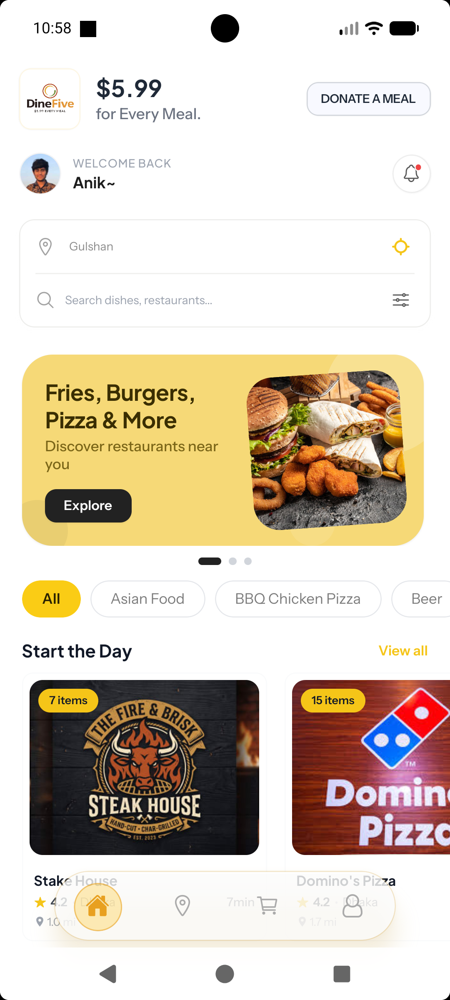
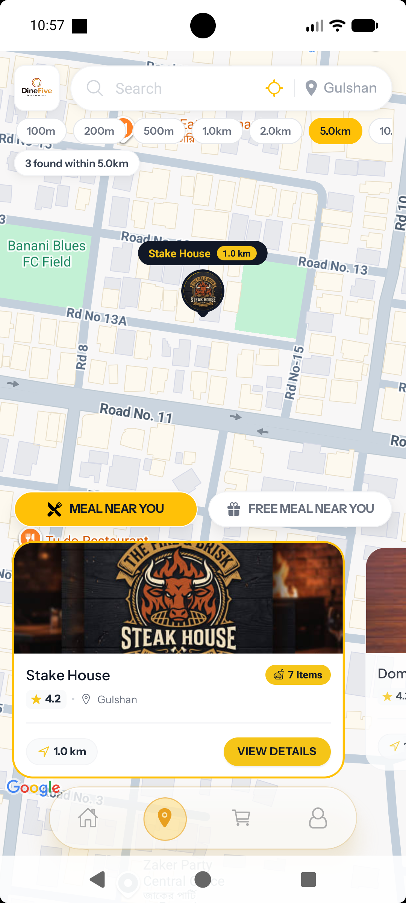
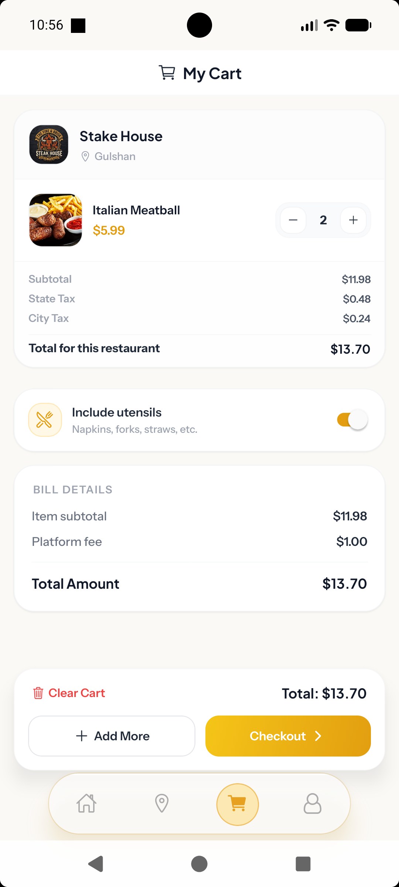
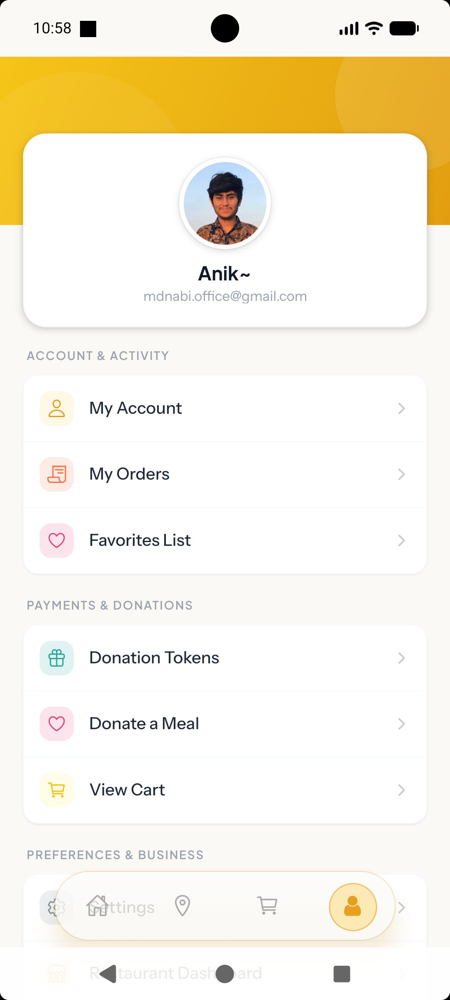
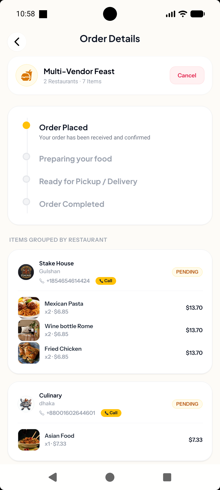

# Dine-Five

<p align="center">
  <a href="https://reactnative.dev/"></a>
  &nbsp;
  <a href="https://expo.dev/"></a>
  &nbsp;
  <a href="https://www.typescriptlang.org/"></a>
  &nbsp;
  <a href="https://sentry.io/"></a>
  &nbsp;
  <a href="https://jestjs.io/"></a>
  &nbsp;
  <a href="https://nativewind.dev/"></a>
  &nbsp;
  <a href="https://creativecommons.org/licenses/by-nc/4.0/"></a>
</p>

Dine-Five is a premium, mobile-first food ordering app built with Expo, React Native, and Expo Router. It delivers a seamless, high-performance user experience, featuring customer onboarding, secure authentication, location-based restaurant discovery, menus, shopping cart management, Stripe checkout, past orders history, and favorites list.

<p align="center">
  <a href="https://play.google.com/store/apps/details?id=com.dinefive.app" target="_blank">
    
  </a>
  &nbsp;&nbsp;
  
</p>

---

## 📱 App Screenshots

<p align="center">
  
  
  
  
  
</p>

---

## 🚀 Key Features

- **Interactive Home Dashboard:** Features a dynamic 2-line location and food searchcard, category filters, rolling banners, and nearby restaurant lists.
- **Location-Aware Discovery:** Dynamically detects coordinates using Expo Location, resolving exact labels, or lets users search and enter addresses manually.
- **Optimized Menus & Food details:** Interactive tabbed menus with scroll synchronization, adding and managing quantities, and product rating/reviews.
- **Favorites with Quick Cart Action:** Custom favorites list with interactive heart icons for toggling and a one-tap `"Add to Bag"` CTA.
- **Secure Authentication:** Complete email/password signup and login flow with OTP verification, reset passwords, and Google Sign-In support.
- **Stripe Payment Sheets:** Unified Stripe sheet checkout workflow for secure billing, supporting tokens and orders.
- **Sentry Real-time Monitoring:** Automated native exception tracking, user error tagging, and crash reporting connected to Sentry dashboard.
- **Automated Testing Suite:** 100% verified unit, component, and Zustand store state test coverage powered by Jest and React Native Testing Library.
- **Profile & Settings Management:** Interactive profile settings, customer support tickets, and account settings (Danger Zone options like Delete Account/Logout).

---

## 🛠️ Tech Stack

- **Core Framework:** Expo 57, React Native 0.81, React 19
- **Navigation:** Expo Router (File-based routing)
- **Styling:** NativeWind & Tailwind CSS (Utility-first CSS styling)
- **State Management:** Zustand with AsyncStorage (Persisted user credentials, authentication token, and cart state)
- **Monitoring & Crash Reporting:** Sentry React Native (`@sentry/react-native`)
- **Automated Testing:** Jest & React Native Testing Library (`@testing-library/react-native`)
- **Native Module Integrations:**
  - Expo Location
  - Expo Notifications & Sync Hooks
  - React Native Maps (with Web fallback)
  - Stripe React Native SDK
  - Google Sign-In SDK

---

## 📁 Project Structure

```text
__tests__/          Automated test suites (unit tests, RNTL component tests, Zustand store tests)
app/                Route groups, pages, navigation layouts, and sub-screens
components/         Reusable UI components for auth, home, cart, map, and profile flows
stores/             Zustand stores managing auth state, restaurant feeds, carts, and orders
services/           Third-party integration services (e.g. Stripe, location)
hooks/              App-level hooks (e.g. notification synchronization, event listeners)
utils/              API handlers, helpers, and shared utilities
assets/             Icons, static banners, screenshots, and visual assets
```

---

## ⚙️ Getting Started

### Prerequisites

- **Node.js:** 18 or newer
- **npm** (Package manager)
- **Emulators/Simulators:** Android Studio (Android) and/or Xcode (iOS) for native verification.
- **Backend URL:** Working instance of the Dine-Five API server.

### 1. Install dependencies

```bash
npm install
```

### 2. Configure Environment Variables

Copy the provided `.env.example` file to create your local `.env` configuration:

```bash
cp .env.example .env
```

Your `.env` file should include the following keys:

```env
# Backend API Base URL
EXPO_PUBLIC_API_URL=https://dine-five-backend-production.up.railway.app

# Google Maps API Key
GOOGLE_MAPS_API_KEY=your_google_maps_api_key_here
EXPO_PUBLIC_GOOGLE_MAPS_API_KEY=your_google_maps_api_key_here

# Sentry Error Tracking & Crash Reporting DSN
EXPO_PUBLIC_SENTRY_DSN=your_sentry_dsn_here
```

- **Note:** LAN and Emulator host redirects are automatically handled in `utils/api.ts` when running against a local development backend.

---

## 🛡️ Error Tracking with Sentry

Dine-Five uses **Sentry React Native** (`@sentry/react-native`) to automatically catch unhandled JS exceptions, native app crashes, and network failure logs.

- **Initialization**: Configured in `app/_layout.tsx` using `Sentry.init` wrapped around the root navigation stack.
- **User Context Tagging**: Automatically tags Sentry error logs with authenticated user ID and email upon login in `stores/slices/authSlice.ts`.
- **Environment Controlled**: Toggle Sentry terminal debug logs using `debug: false` or environment DSN configuration.

---

## 🧪 Automated Testing (Jest & RNTL)

Dine-Five includes automated unit, UI component, and state store testing configured via **Jest** and **React Native Testing Library**.

### Running Tests

Run all test suites:

```bash
npm test
```

Run tests in watch mode (auto re-runs on file save):

```bash
npx jest --watch
```

### Test Coverage Highlights

- **Unit Tests (`__tests__/utils/mapHelpers.test.ts`)**: Tests map radius formatting (`500m`, `1.0km`) and query string normalization.
- **UI Component Tests (`__tests__/components/`)**:
  - `GradientButton.test.tsx`: Tests button rendering and user press event handlers.
  - `CustomInput.test.tsx`: Tests text entry, label rendering, icons, and `secureTextEntry`.
- **Zustand Store Tests (`__tests__/stores/cartSlice.test.ts`)**: Tests initial cart state, `addToCart`, quantity updates, item removals, and missing auth token guards.

---

## 🏗️ Prebuild & Run

```bash
npm expo prebuild --clean
npm expo run --device
```

Platform-specific commands:

```bash
npm run android    # Run Android development build
npm run ios        # Run iOS Simulator
npm run web        # Run in Web browser
```

---

## ⚖️ License

This project is licensed under the [Creative Commons Attribution-NonCommercial 4.0 International (CC BY-NC 4.0)](LICENSE) License.
